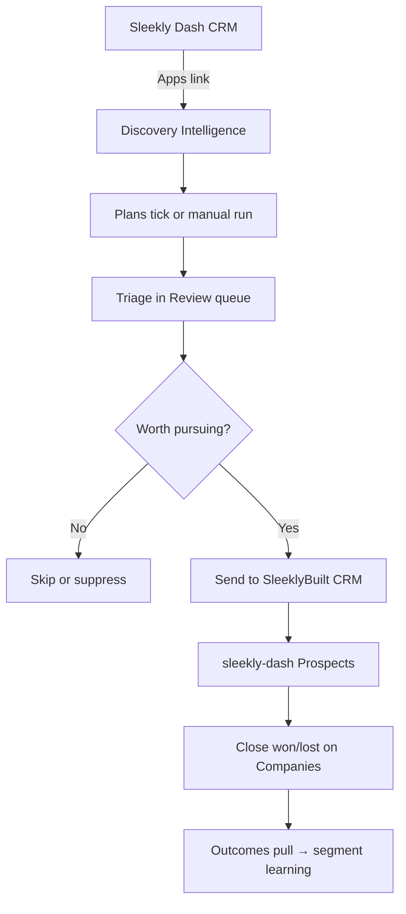

# Discovery Intelligence — Operator Playbook

Discovery Intelligence is **Lead Discover / Demand Capture**, opened from sleekly-dash via **Apps → Discovery Intelligence**.

**Source of truth:** [`C:\xampp\htdocs\lead discover - sleekly`](../../lead%20discover%20-%20sleekly/).  
`sleeklybuilt/discovery` is a junction to that tree (C0). Do not edit a nested duplicate.

sleekly-dash remains the **operations CRM**. Use Discovery for outbound research and qualification; push qualified leads into **Prospects** via the live service bridge (`SLEEKLY_DASH_*`).

---

## Quick start (local)

### 1. Run sleekly-dash

```powershell
cd C:\xampp\htdocs\sleeklybuilt
npm run dev
# CRM: http://localhost:5174/sleekly-dash/
```

Ensure XAMPP **Apache + MySQL** are running.

### 2. Run Demand Capture

Prefer the canonical tree:

```powershell
cd "C:\xampp\htdocs\lead discover - sleekly"
pnpm install
cp .env.example .env   # set DATABASE_URL for local Postgres
pnpm db:migrate
pnpm dev
# Discovery: http://localhost:3000
```

Or from the sleeklybuilt root (junction → same tree):

```powershell
npm run discovery:db:migrate
npm run dev:discovery
```

For discovery runs to complete, also run the job worker in a second terminal:

```powershell
npm run discovery:jobs:worker
# or: cd "C:\xampp\htdocs\lead discover - sleekly" && pnpm jobs:worker
```

Configure **Google Places API** (minimum) via Settings → API credentials in the Demand Capture UI, or see [SETUP_RESOURCES.md](../../lead%20discover%20-%20sleekly/docs/SETUP_RESOURCES.md).

### 3. Open from sleekly-dash

Sidebar → **Apps → Discovery Intelligence** (opens in a new tab).

Dev URL is set in `sleekly-dash/frontend/.env.development`:

```env
VITE_DISCOVERY_URL=http://localhost:3000
```

---

## Daily workflow



### Step 1 — Find leads (Discovery)

In Demand Capture:

1. **Plans** (`/discovery/plans`) — schedule discovery or monitor plans (preferred overnight path). See Lead Discover [`docs/DISCOVERY_PLANS.md`](../../lead%20discover%20-%20sleekly/docs/DISCOVERY_PLANS.md).
2. **Discovery** (`/discovery`) — optional one-off geo + industry run.
3. **Demand inbox** (`/intent/inbox`) — paste/RSS/Reddit signals (optional).
4. Wait for the worker to finish pipeline stages.

### Step 2 — Triage (Discovery)

1. Open **Review** (`/review`) — unified work queue.
2. Open opportunity briefs; reject low-fit leads.
3. Compose outreach in Discovery (copy / mailto / wa.me + record) — no mass auto-send.

### Step 3 — Hand off to sleekly-dash (live bridge)

**Preferred — live CRM push**

1. Configure `SLEEKLY_DASH_BASE_URL` + `SLEEKLY_DASH_SERVICE_TOKEN` in Discovery Settings (or env).
2. On a lead hub (or bulk selection): **Send to SleeklyBuilt CRM**.
3. Prospect upserts into sleekly-dash by `discovery_account_id` (idempotent).
4. Close won/lost with project value on the Company in sleekly-dash.
5. Discovery worker pulls outcomes ~every 5 minutes → `lead_outcomes` → segment scoring + plan yield.

**Fallback — CSV** (only if the bridge is not configured)

1. Export Outreach CSV from Demand Capture.
2. Import in sleekly-dash Prospects if your deployment still uses that path.
3. Prefer enabling the live bridge for outcome learning.

### Step 4 — Close the loop

1. In sleekly-dash: pursue Prospects → convert to Companies when ready.
2. Record outcomes (won/lost, value, loss reason).
3. In Discovery `/ops`: check **Outcome learning** (segment conversion + revenue by plan).

---

## CSV column mapping reference (legacy fallback)

| Demand Capture export | Prospects import field |
|----------------------|---------------------------|
| `business` | `name` |
| `name` | `name` |
| `city` + `country` | `location` |
| `industry` | `industry` |
| `subject`, `body`, `maps_url`, `website` | `notes` (combined) |
| (auto when DC columns detected) | `source` = `Discovery Intelligence` |
| `priority` | `priority` (high \| medium \| low) |
| `status` | `status` (not_contacted \| contacted \| qualified) |

Prefer the **live bridge** above so closed-won/lost outcomes feed Discovery learning.

---

## Production deployment

**Target:** Google Compute Engine VM (Docker Compose) — same host as sleeklybuilt. See [DEPLOY_GCLOUD.md](./DEPLOY_GCLOUD.md).

Until then, legacy Vercel/Neon instructions remain in the Lead Discover [`docs/DEPLOYMENT.md`](../../lead%20discover%20-%20sleekly/docs/DEPLOYMENT.md).

After deploy, set the live URL in sleekly-dash production env:

```env
# sleekly-dash/frontend/.env.production
VITE_DISCOVERY_URL=https://discovery.sleeklybuilt.pro
```

Rebuild sleekly-dash: `npm --prefix sleekly-dash/frontend run build` or full `npm run build`.

### Auth note

v1 uses **two logins**: sleekly-dash (PHP session) and Demand Capture (Clerk in production). This is expected for the federated model. SSO can be added later if needed.

---

## Troubleshooting

| Issue | Fix |
|-------|-----|
| Sidebar link goes to wrong URL | Check `VITE_DISCOVERY_URL` in the env file used at build time |
| Discovery runs stuck | Ensure `pnpm jobs:worker` is running |
| CRM push fails | Set `SLEEKLY_DASH_BASE_URL` + `SLEEKLY_DASH_SERVICE_TOKEN`; confirm service token only allows `/api/integrations/*` |
| Outcomes not learning | Close won/lost with value in sleekly-dash; wait for worker sync (~5m) or POST `/api/integrations/sleekly-dash/sync` |
| Monitor plan empty | Run a discovery plan for that city × industry first so known accounts exist to seed |
| Two CRMs confusion | Discovery = intelligence; sleekly-dash = operations after push |

---

## Related docs

- [ECOSYSTEM.md](./ECOSYSTEM.md) — monorepo layout + Discovery source-of-truth (C0)
- Lead Discover [`README.md`](../../lead%20discover%20-%20sleekly/README.md) — pnpm commands
- Lead Discover [`docs/DISCOVERY_PLANS.md`](../../lead%20discover%20-%20sleekly/docs/DISCOVERY_PLANS.md) — plans, monitor, CRM loop
- Lead Discover [`docs/OPERATING_MODEL.md`](../../lead%20discover%20-%20sleekly/docs/OPERATING_MODEL.md) — daily ops
- Lead Discover [`docs/DEPLOYMENT.md`](../../lead%20discover%20-%20sleekly/docs/DEPLOYMENT.md) — deploy reference
- [DISCOVERY_SOURCE.md](./DISCOVERY_SOURCE.md) — C0 canonical path / junction / archive
- Archive (do not build): `../sleeklybuilt - Legacy/discovery-2026-07-29/`
